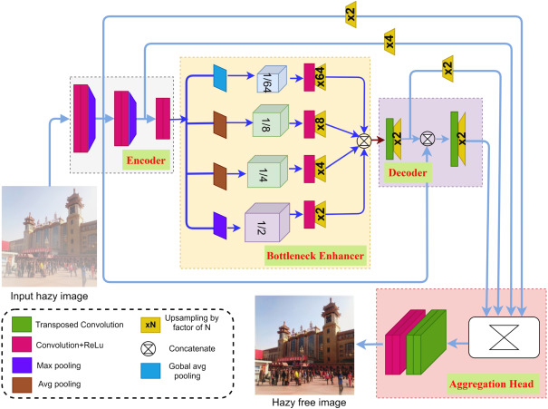

# Adverse Weather Image Processing (CMU 10701 Project)

> **Abstract:** 
Haze is a common phenomenon that affects the visibility and clarity of natural images. Aerosols
and adverse weather conditions such as dust, mist, fog, and snow can create haze. In normal day-to-
day life, this phenomenon can cause wrong object detection and serious traffic security issues. In
computer vision, a hazy image impacts the quality of analysis and thus results in unreliable high-level
computer vision applications such as self-driving cars. This is why image de-hazing is considered of
great importance in computer vision. In this project, we are focusing on using several architectures for image dehazing such as - the swin transformer based DehazeFormer, the multiple color channel based feature map from TheiaNet, and the transformer based sematic segmentation model HRNet.


## Workload
**Project initialization**:
- [x] Reproduce [DehazeFormer](https://github.com/IDKiro/DehazeFormer) results

**Experimental pipeline**:
- [x] Add convinient experiment logging with [WandB](https://wandb.ai/)
- [x] Add flexible experiment infrastructure based on [Pytorch Lightning](https://www.pytorchlightning.ai/)
- [x] Add flexible configuration file for experiments
- [x] Log number of parameters and computational complexity

**Features**:
- [x] Arbitrary number of loss functions
- [x] Arbitrary number of metrics
- [x] Quadruple color space

**Architectures**:
- [x] DehazeFormer
- [x] HRNet
- [x] HRTransformer
- [x] A-HRNet
- [x] TheiaNet
- [x] ESDNet

**Writing**:
- [x] Proposal
- [x] Midway report
- [ ] Final report

## Installation and usage

### Installation
```bash
conda create -n dehazing python=3.7
conda activate dehazing
pip install -r requirements.txt
```

### Usage
We provided various configuration's files for our porgect in the folder `configs`. Feel free to pick one of theme or 
create your own config file by following `configs/config.yaml`. 

To train the model you should run the next line:
```bash
python lightning.py configs/config.yaml
```
To test the model you should run this line:
```bash
python lightning.py configs/theianet.yaml --test --ckpt_path="your_checkpoint.ckpt"
```

## Experimental results

### Dataset

We are using one of the most common benchmarking dataset in image dehazing —
the [RESIDE](https://sites.google.com/view/reside-dehaze-datasets/reside-%CE%B2?authuser=0)
dataset. The RESIDE dataset has three versions — RESIDE-V 0, RESIDE-standard, and RESIDE-β.
IAs we want to compare our modified architecture and loss functions with the base 
architectures, we will be using the RESIDE-6k dataset, which used a combination of 3000 
indoor image pairs (ITS) and 3000 outdoor image pairs (OTS) for training and 1000 images
from synthetic outdoor images (SOTS) for testing.

We did not use other datasets because the experiments is computationally intense, so we decided 
to focus on comparing different architectures on one dataset. 

## Architectures

### DehazeFormer

We chose Dehazeformer architecture as our initial architecture for several reasons.
- According to the paperswithcode id demonstrated the best performance on the well known
datasets
- It utilizes the idea of U-net and vision transformers, which are very powerful 
in multiple computer vision tasks (object detection, semantic segmentation, etc.).
- There was an open code for the paper, so It was a great starting point

<figure>

<figcaption>The DehazeFormer architecture: general U-Net structure and the structure 
of the block</figcaption>
</figure>


### HRNet and HRTransformer

Since U-Net and HRNet both used for semantic segmentation (image-to-image), we added it to 
our project.

- HRNet outperformed standard U-Net and later DeepLabv3 on semantic segmentation models
- The key difference from standard U-Net is using feature pyramid pooling (FPN) and cross
level connections
- HRTransformer utilizes the same idea but uses Transformer modules instead of convolutional
ones

<figure>

<figcaption>The HRNet architecture: FPN allows the NN to combine features from different
levels</figcaption>
</figure>

### A-HRNet
- ToDo

### ESDNet

The ESDNet is SotA architecture for Image Demoiréing problem, which we found very similar. 

- It uses scale aware modules (SAM) to handle moir´e (haze in our case) patterns with diverse scales. 
It uses a pyramid context extraction module to effectively and efficiently extract multiscale features.
- ESDNet adopts a simple encoder-decoder  network with skip-connections as its backbone and stacks SAM at different 
semantic levels
- ESDNet can be very efficient on hardware

<figure>

<figcaption> </figcaption>
</figure>


### TheiaNet

A very fast and efficient TheiaNet architecture was build for the dehazing problem
- TheiaNet enables haze removal in a highly resource constrained environments
- Uses quadruple color space (RGB, HSV, LAB, YCbCr)
- More efficient than other models (CNN, GANs, Transformers)
- The simplicity of the network is augmented
- Uses the similar idea with FPN


<figure>

<figcaption> TheiaNet is a fast and optimized architecture for image dehazing </figcaption>
</figure>

## Model's training
The learning curves for different models are presented on the next graphs:

<figure>

<figcaption> SSIM score for different models: ESDNet is the best model according to the score
</figcaption>
</figure>

<figure>

<figcaption> PSNR score for different models: DehazeFormer and ESDNet are 
ate the top</figcaption>
</figure>


## Complexity comparison
Due to limited computational resourse we target to compare resonably small models, 
which fit one GPU. Here we demonstrate what is the compuational complexity and 
the number of parameters for different models. 

<figure>

<figcaption> Compuational complexity of the models</figcaption>
</figure>

<figure>

<figcaption> Number of parameters of the models</figcaption>
</figure>


## Notes
Currently, the code of this repository is under development. We will be updating architectures as we implement 
them as part of our project.
